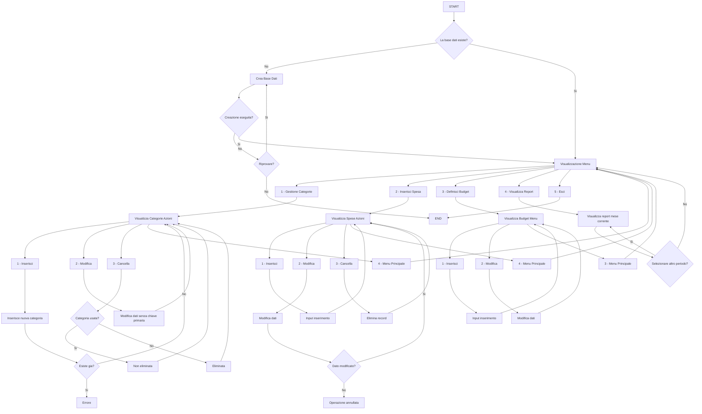

# GaetanoFallettaPersonalExpenseSystem
GESTIONE DELLE SPESE PERSONALI E DEL BUDGET

```mermaid
flowchart TD

A[START] --> B{La base dati esiste?}

B -- No --> C[Crea Base Dati]
C --> D{Creazione eseguita?}

D -- No --> R{Riprovare?}
R -- Si --> C
R -- No --> Z[END]

D -- Si --> M[Visualizzazione Menu]
B -- Si --> M

M --> MC[1 - Gestione Categorie]
M --> MS[2 - Inserisci Spesa]
M --> MB[3 - Definisci Budget]
M --> MR[4 - Visualizza Report]
M --> ME[5 - Esci]

ME --> Z

%% CATEGORIE
MC --> VC[Visualizza Categorie Azioni]

VC --> C1[1 - Inserisci]
VC --> C2[2 - Modifica]
VC --> C3[3 - Cancella]
VC --> C4[4 - Menu Principale]

C1 --> IC[Inserisce nuova categoria]
IC --> EC{Esiste gia?}

EC -- Si --> ER[Errore]
EC -- No --> VC

C2 --> MC2[Modifica dati senza chiave primaria]
MC2 --> VC

C3 --> CC{Categoria usata?}
CC -- Si --> NDEL[Non eliminata]
CC -- No --> DEL[Eliminata]

NDEL --> VC
DEL --> VC

C4 --> M

%% SPESE
MS --> VS[Visualizza Spese Azioni]

VS --> S1[1 - Inserisci]
VS --> S2[2 - Modifica]
VS --> S3[3 - Cancella]
VS --> S4[4 - Menu Principale]

S1 --> IS[Input inserimento]
IS --> VS

S2 --> SM[Modifica dati]
SM --> DM{Dato modificato?}
DM -- No --> OA[Operazione annullata]
DM -- Si --> VS

S3 --> SD[Elimina record]
SD --> VS

S4 --> M

%% BUDGET
MB --> VB[Visualizza Budget Menu]

VB --> B1[1 - Inserisci]
VB --> B2[2 - Modifica]
VB --> B3[3 - Menu Principale]

B1 --> IB[Input inserimento]
IB --> VB

B2 --> BM[Modifica dati]
BM --> VB

B3 --> M

%% REPORT
MR --> VR[Visualizza report mese corrente]
VR --> SP{Selezionare altro periodo?}

SP -- Si --> VR
SP -- No --> M
```
